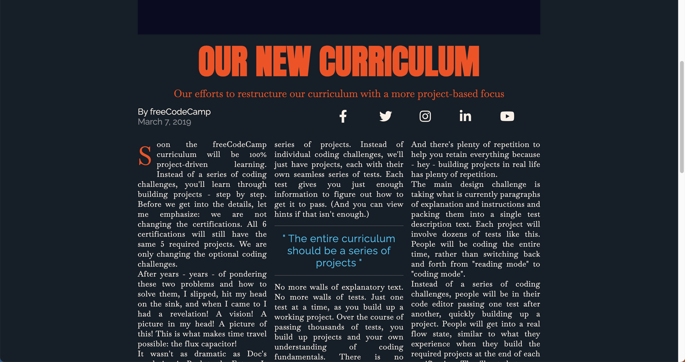

# Magazine

For this project I built a magazine page that showcases CSS Grid design.  Use of columns for text and images that change for best user experience for what ever screen size page is being viewed on.

## Preview

Deployed via Github [pages](https://katepatch.github.io/Magazine/)

## Screenshot

Full Size screen columns 

When screen size shrinks to tablet size the columns fit to size.

When screen size shrinks to mobile phone size it fits to single column

## Questions

For questions regarding this project or any others I can be reached at: 
Github: [katepatch](https://github.com/katepatch) 
Email: kate.epatch@gmail.com